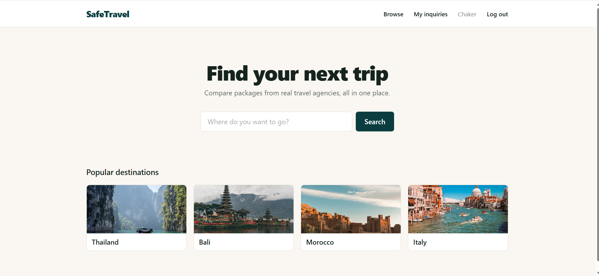
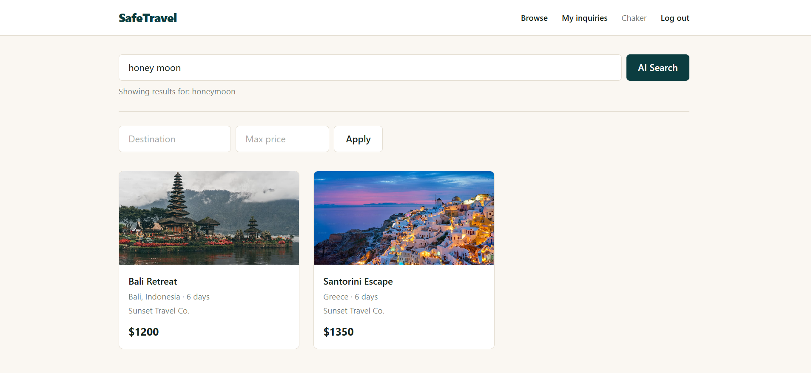
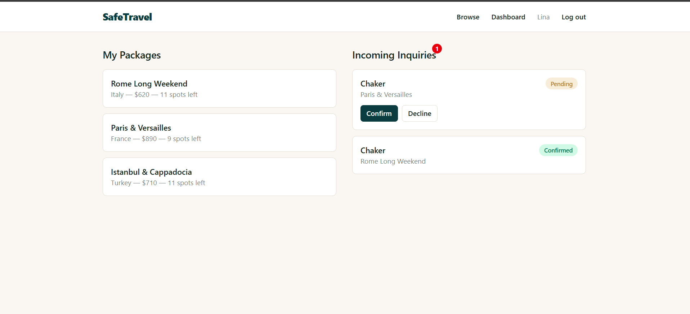
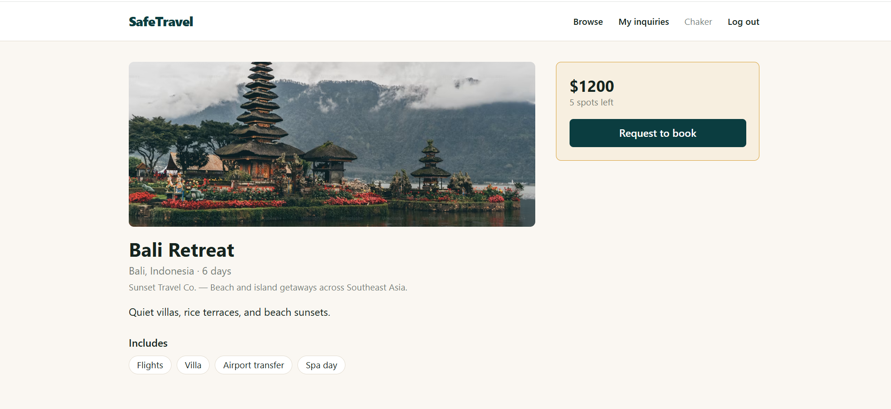

# SafeTravel

A two-sided travel package marketplace. Agencies list curated packages (flights + hotel + extras); travelers search, compare, chat directly with agencies, and request to book — replacing the scattered Instagram/Facebook DM hunt most small travel agencies currently rely on.

## Features

- **AI-powered natural language search** — type something like "romantic honeymoon getaway" and the app interprets it into structured filters (destination, price, tags) using an LLM via OpenRouter. Falls back to plain keyword search automatically if the AI service is unavailable, so search never breaks.

  

- **Real-time chat** — travelers and agencies message directly inside an inquiry thread, powered by Socket.IO.
- **Live spots counter** — "Request to book" decrements available spots in real time across every browser currently viewing that package.
- **Live inquiry notifications with approve/decline** — agencies see new inquiries appear on their dashboard instantly with a notification badge, and can confirm or decline each request directly from the list.

  

- **Package detail pages** with full trip info, live spots counter, and a direct "Request to book" flow into chat.

  

- **Traveler dashboard** — every inquiry a traveler has made, with live status (pending/confirmed/declined), linking straight into the chat.
- **Role-based accounts** — register as either a traveler or an agency, with agency-specific fields (agency name, description, logo).

## Tech Stack

**Frontend:** React (Vite), React Router v7, Tailwind CSS, Axios, Socket.IO client
**Backend:** Node.js, Express, MongoDB with Mongoose, Socket.IO, JWT authentication (httpOnly cookies), bcrypt
**AI:** OpenRouter API (free tier)

## Setup

### Prerequisites
- Node.js installed
- A MongoDB Atlas connection string (or local MongoDB)
- An OpenRouter API key (free at [openrouter.ai](https://openrouter.ai))

### 1. Clone the repo

git clone https://github.com/ChakerIbrahim/MernSoloProject.git
cd MernSoloProject

### 2. Server setup

cd server
npm install

Create a `.env` file inside `server/` with:

PORT=8000
MONGOOSE_URI=your_mongodb_connection_string
SECRET=any_long_random_string
OPENROUTER_API_KEY=your_openrouter_key

Seed the database with demo data (agencies, packages across 9 destinations, and a demo traveler account):

node seed.js

Start the server:

nodemon server.js

### 3. Client setup
Open a second terminal:

cd client
npm install
npm run dev

The app runs at `http://localhost:5173`, with the API on `http://localhost:8000`.

## Demo Accounts

Running `node seed.js` creates:
- **Traveler:** sara@traveler.com / password123
- **Agencies:** amara@sunsettravel.com, karim@peaktrails.com, lina@citybreakstravel.com — all use password123

## Project Structure

SafeTravel/
├── server/
│ ├── config/ # Database connection
│ ├── controllers/ # Route logic (users, packages, inquiries, AI search)
│ ├── middleware/ # JWT auth verification
│ ├── models/ # Mongoose schemas
│ ├── routes/ # Express route definitions
│ ├── seed.js # Demo data seeding script
│ └── server.js # Entry point — Express + Socket.IO setup
└── client/
└── src/
├── components/ # Reusable UI (Header, forms, cards)
├── context/ # Auth state (AuthContext)
├── pages/ # Route-level pages
├── utils/ # Destination image lookup
├── App.jsx # Route definitions
└── socket.js # Shared Socket.IO client instance